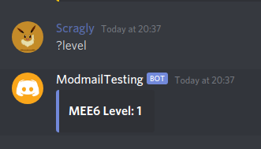
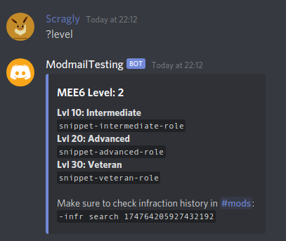
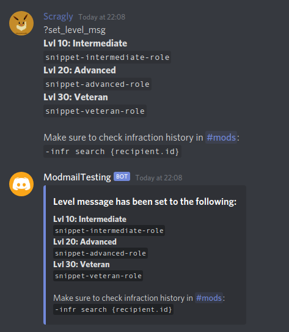

# MEE6 Level Plugin

## Installation
```
?plugin add scragly/modmail-plugins/mee6-level@main
```


> Specifying `@main` is required as modmail expects `master` branch to be the default

## Commands

### `?level`
Show recipient's MEE6 level.  

Stats are from the main server even if modmail threads are in a secondary server.  

You can add a message to include with the `set_level_msg` command, with support for
the same variables as `freply`.


#### Without a level message set.  



#### With a level message set.  




---

### `?set_level_msg`

Sets a message to add to level responses.  

Can be useful as a quick reference for role/perk level requirements,
and supports the same variables as `freply`.  

To remove any existing message, run the command without any arguments.


